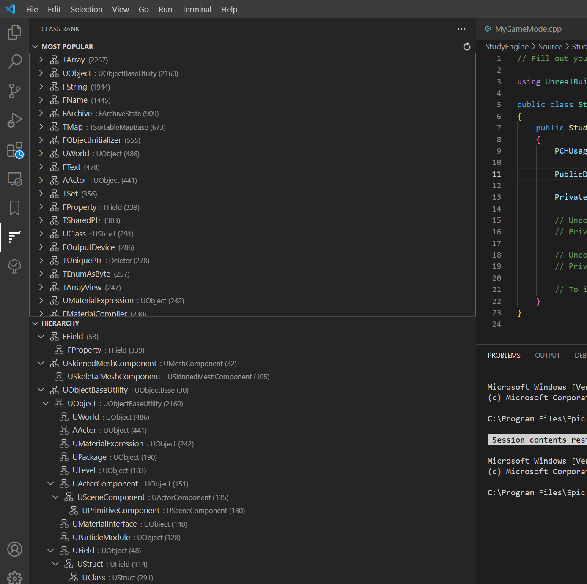

# ClassRank, A VSCode Extension for reading large project.




## Motivation

I was reading the Unreal Engine 5 project, which is a large C++ project.

I wanted to know which classes are important than others.

I thought a class which was mentioned by many other source files should be important, likewise, a class only mentioned in its own file probably could be ignored in the beginning.
With this in mind, I created this project.

This is a VSCode extension (because I use VSCode) written in Typescript. It is a working prototype (only supports C++ and with many hard-codings), and I'll be refine it along the way.


## Install

This extension has not been published yet. There isn't a way to install that from VSCode extension market.

You can follow the steps here: https://code.visualstudio.com/api/get-started/your-first-extension to open a debugging VSCode window that has loaded the extension.

Basically, 

(1) Install NPM.

(2) Install the dependencies of this project.
```
npm install 
```

(3) Use VSCode to open this project, and press F5 to start the debugging editor.

## Usage

After launch the debugging VSCode, open a project folder or a VSCode workspace file. Multi-folder workspace is supported.

On the left, there will be a tab


## Contributors needed

Any form of contribution (including fixing my typo in this very README document) will be warmly welcomed! Making friends is as important as making tools!

I hope we can make it faster, make the UI more understandable, and cover other common use cases such as ranking a Python project.


## Issues

Currently, I'm using Regular Expression to parse the source file. But different situations in the source code might be quite complicated, and will be too hard to use one single expression to cover.

Here are some positive cases and negative cases, and I have not come up with a good expression to describe the pattern.

```c++
//Should be positive:
    class public EMPTYREF_API AEmptyRefGameModeBase : public AGameModeBase
class CBOR_API FCborReader
class FMetalBlitCommandEncoderDebugging : public FMetalCommandEncoderDebugging
class FMetalSubBufferHeap
class AIMODULE_API FEQSSceneProxy final : public FDebugRenderSceneProxy
class AUDIOMIXERCORE_API FMixerNullCallback : protected FRunnable
class TLockFreeClassAllocator_TLSCache : private TLockFreeFixedSizeAllocator_TLSCache<sizeof(T), TPaddingForCacheContention, FNoopCounter , AllowDisablingOfTrim>
class FSoundFileReader final : public ISoundFileParser, public ISoundFileReader

//Should be negative:
/* AGXRHIPrivate.h: Private AGX RHI definitions. */
uint32 TableAllocSize = (Table->BlockSize > BinnedSizeLimit ? (((3 * (i - BinnedSizeLimit)) + 3)*Private::BINNED_ALLOC_POOL_SIZE) : Private::BINNED_ALLOC_POOL_SIZE);
class FNvClothErrorCallback* GNvClothErrorCallback;
	class FNvClothAssertHandler* GNvClothAssertHandler;
	class FrameProTLS;
		Class CurrentClass = self.class;
```

## Issues

There's only one copy of cache, so different workspace shares the same cache file (which is wrong).